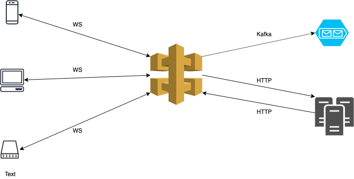
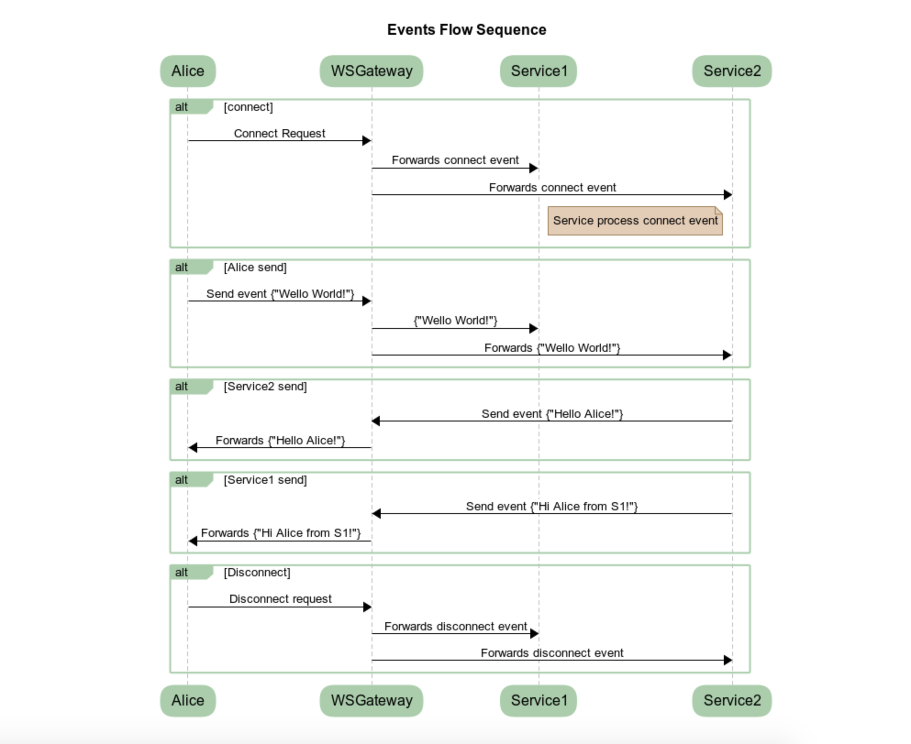

# WSGateway - Specs Draft v2

## Overview

What is an API Gateway? An API Gateway is the component that takes all the incoming requests from clients and forwards them to the appropriate microservice.

Historically, building WebSocket APIs required setting up fleets of hosts that were responsible for managing the persistent connections that underlie the WebSocket protocol. Now, with WS API Gateway, this is no longer necessary. API Gateway handles the web socket connections between with clients and let you to build your business logic using HTTP-based or Kafka based microservices/services.

For more about API Gateways check [here](https://microservices.io/patterns/apigateway.html)  

## WSGateway Arhitecture

## Functional Requirements

- WSGateway from clients should accept only persistent, full duplex connections based on WebSocket protocol
- WSGateway forwards all the incoming events to one or multiple HTTP endpoints or to one or multiple Kafka Topics
- WSGateway receives HTTP requests from different internal microservices and forwards messages through WebSocket to the clients
- All events are JSON based
- Each endpoint configuration can pe modified and applied without restarting the Gateway 
- All endpoint configurations will be stored and user should be able to apply any version of the configuration at anytime
- Multiple options of authentication and configurable by endpoint
- Throttling by endpoint (low priority)
- Dashboard with statistics (low priority)
- Transformations
- Admin UI
- Option to instant reply to sender, for example sending an ack (low priority)

## Non Functional Requirements 
- Resilient
- No SPoF(single point of failure)
- Scalable
- Low response times
- High throughput

### Concepts 
1. Gateway: the single service that clients needs to know. 
2. Endpoint: an endpoint is used to gather multiple microservices to a single connection   
3. Route: a route describe how an event should be handled. An endpoint is composed by multiple routes and by default one endpoint will have 4 routes: connect route, disconnect route, error route and default route. Users will be able to create new custom routes based on event payload using different custom defined json paths.

#### Event Flow Sequence 

#### Similar Solutions
- [AWS Gateway](https://aws.amazon.com/blogs/compute/announcing-websocket-apis-in-amazon-api-gateway/)
- Maybe [Kong](https://github.com/Kong/kong)
- Maybe [Tyk](https://tyk.io/api-gateway/open-source/)
- Check about Kaazing

### Drafts

##### Authentication options:
- None
- Api Key
- OAuth2

##### Endpoint configuration proposal [Config](api/endpoint-config-sample.json)

